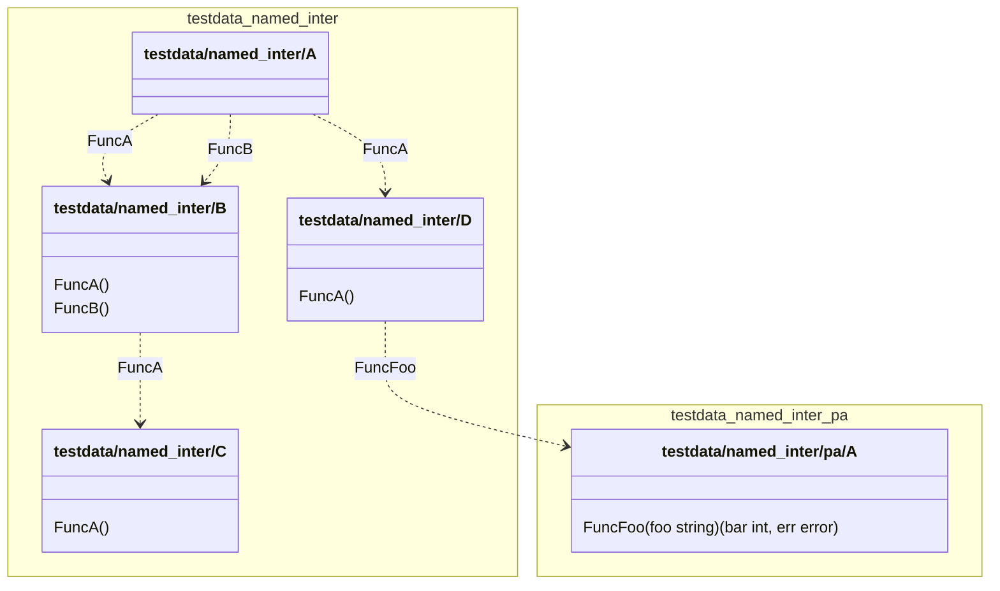

# go-dependency-graph

A tool to build dependency graph for go programs based on dependency injection functions.

# Install

```
go install github.com/emilien-puget/go-dependency-graph/cmd/go-dependency-graph@latest
```

# How to Use

You can customize the behavior of the tool using these parameters:

`--generate-diag=false`: Disable diagram generation.
`--generate-mocks=false`: Disable mocks generation.
`--project=<path to project>`: the targeted project, default is current directory.

## Diagrams

`go-dependency-graph --project=<path to project> --diag-result=<result file> --diag-generator=<generator>`

Available generators include:

- `c4_plantuml_component`, default, a components diagrams
  using [c4 plantuml](https://github.com/plantuml-stdlib/C4-PlantUML)
- `mermaid_class`, a class diagram
  using [mermaid](https://mermaid-js.github.io/mermaid/#/classDiagram?id=class-diagrams)

### Note regarding mermaid

Please note that GitHub does not support the namespace feature of MermaidJS class diagrams.
You can use the [mermaid cli](https://github.com/mermaid-js/mermaid-cli) to generate SVG, PNG, or PDF files.

## Mocks

`go-dependency-graph --project=<path to project> --mock-result=<result directory> --mock-generator=<generator>`

mock-result default value is the `mocks` directory at the root of the project dir.

Available generators include:

- `mockery`, default, [mockery](https://github.com/mockery/mockery)

# Example

## [Simple example with interfaces](./pkg/parse/testdata/inter)

### c4 plantuml component

```puml
@startuml
!include https://raw.githubusercontent.com/plantuml-stdlib/C4-PlantUML/master/C4_Component.puml

title testdata/named_inter

Container_Boundary(testdata/named_inter, "testdata/named_inter") {
Component("A", "A", "", "")
Component("B", "B", "", "")
Component("C", "C", "", "")
Component("D", "D", "", "")

}


Container_Boundary(pa, "pa") {
Component("pa_A", "A", "", "A pa struct.")

}
Rel("A", "B", "FuncA")
Rel("A", "B", "FuncB")
Rel("A", "D", "FuncA")
Rel("B", "C", "FuncA")
Rel("D", "pa_A", "FuncFoo")

@enduml
```

[www.plantuml.com](http://www.plantuml.com/plantuml/uml/ROx1QWCX48RlFeNTKmBDUkcff-owvDH2AVIyJ5Pf11r5HqefVVTg0akIUj33z_qpy-yJGQJiB7imkDYiD3yHXVGiH8Il_jFGAHzpqd7nI1gfNxmJmGBMcLqYPSrHoAVTMqKVho_2GI8T2vgbTy5ZdGbrFoD3LdFIPGW818BJQZPOqen9ZmG6TPn7dr51_DwqWe-yQ-5kot_OUcxJ3Lq9dh_psrwxiQAnxMH5ikscYgOhntvPitU0uWFSTmemtzOQU02UAEQ5-ikwTsrBzxNV8UCo5DF0umsUxjENeFo7Qt0jKit1-tfwhr5bP_y0)

### mermaid class


