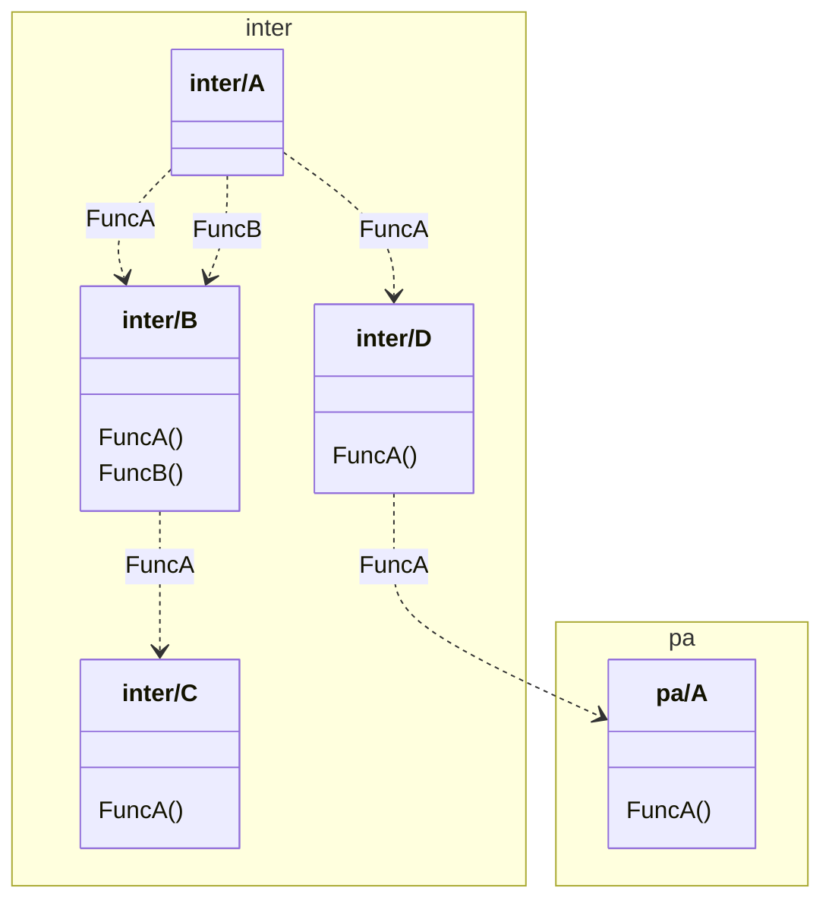
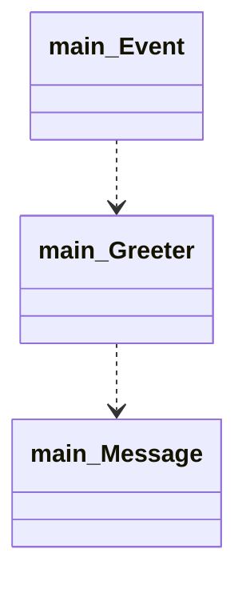

# go-dependency-graph

A tool to build dependency graph for go programs based on dependency injection functions.

# Install

```
go install github.com/emilien-puget/go-dependency-graph/cmd/go-dependency-graph@latest
```
# Note regarding mermaid

GitHub doesn't support the namespace feature of the mermaidjs class diagram, you can use the
cli https://github.com/mermaid-js/mermaid-cli to generate a svg/png/pdf file.

# Example

## [Simple example with interfaces](./pkg/parse/testdata/inter)

### c4 plantuml component

```puml
@startuml
!include https://raw.githubusercontent.com/plantuml-stdlib/C4-PlantUML/master/C4_Component.puml

title testdata/inter
AddElementTag("external", $bgColor="#8CDE42FF")

Container_Boundary(inter, "inter") {
Component(inter.A, "inter.A", "", "")
Component(inter.B, "inter.B", "", "")
Component(inter.C, "inter.C", "", "")
Component(inter.D, "inter.D", "", "")

}


Container_Boundary(pa, "pa") {
Component(pa.A, "pa.A", "", "A pa struct.")

}
Rel(inter.A, "inter.B", "FuncA")
Rel(inter.A, "inter.B", "FuncB")
Rel(inter.A, "inter.D", "FuncA")
Rel(inter.B, "inter.C", "FuncA")
Rel(inter.D, "pa.A", "FuncA")

@enduml
```

http://www.plantuml.com/plantuml/uml/RO_1QiGW48RlFeNDgO5klFJKOqFPInTAeUSmcmn6K2CwDYobxzvHaYvTUX3znfdlrplZHvidb3DHI4zAHLWxRMZEvvmmZeidzDIDYrF1WgVix27HPCrPzO-7jrBwEBqg1uamScde5nSMNsO2zmf1XYnAGXu20hMQY4C25omAqRCTZCSuF2_PJn0lzuxvGJPbQrhv9NvrzQOxHaGEsZfsR9ZBsb2Q96dcq4j0ESuGDKvovJz9NHgCrr9dVb3gclOsuEMJZxk-mYwlKDGWDR0-5i_LYh7gnBTuHtlps4edJ0aq_gNsshqb_pEvKIj-0000

### mermaid class



## [Wire tutorial](https://github.com/google/wire/blob/main/_tutorial/main.go)

### c4 plantuml component

```puml
@startuml
!include https://raw.githubusercontent.com/plantuml-stdlib/C4-PlantUML/master/C4_Component.puml

title testdata/wire_sample

Container_Boundary(main, "main") {
Component(main.Greeter, "main.Greeter", "", "Greeter is the type charged with greeting guests.")
Component(main.Event, "main.Event", "", "Event is a gathering with greeters.")

}
Rel(main.Greeter, main.Message, main.Message)
Rel(main.Event, main.Greeter, main.Greeter)

@enduml
```

http://www.plantuml.com/plantuml/uml/RO_1QiGW48RlFeNDgO5klFJKOqFPInTAeUSmcmn6K2CwDYobxzvHaYvTUX3znfdlrplZHvidb3DHI4zAHLWxRMZEvvmmZeidzDIDYrF1WgVix27HPCrPzO-7jrBwEBqg1uamScde5nSMNsO2zmf1XYnAGXu20hMQY4C25omAqRCTZCSuF2_PJn0lzuxvGJPbQrhv9NvrzQOxHaGEsZfsR9ZBsb2Q96dcq4j0ESuGDKvovJz9NHgCrr9dVb3gclOsuEMJZxk-mYwlKDGWDR0-5i_LYh7gnBTuHtlps4edJ0aq_gNsshqb_pEvKIj-0000

### mermaid class



# Installation

`go install github.com/emilien-puget/go-dependency-graph@latest`

# How to Use

## Generator

`go-dependency-graph --project=<path to project> --result=<result file> --generator=<generator>`

Available generator are as follows

- `c4_plantuml_component`, the default value, more information about that format
  here : https://github.com/plantuml-stdlib/C4-PlantUML
- `json`, the struct `parse.AstSchema` encoded in JSON
- `mermaid_class`, a class diagram using mermaid
  syntax https://mermaid-js.github.io/mermaid/#/classDiagram?id=class-diagrams

### With the result written to a file

`go-dependency-graph --project=<path to project> --result=<result file>`

### With the result piped

`go-dependency-graph --project=<path to project> > <piped>`

